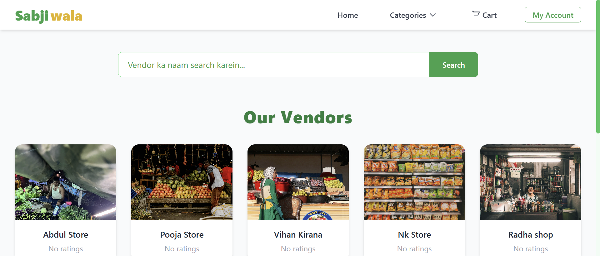
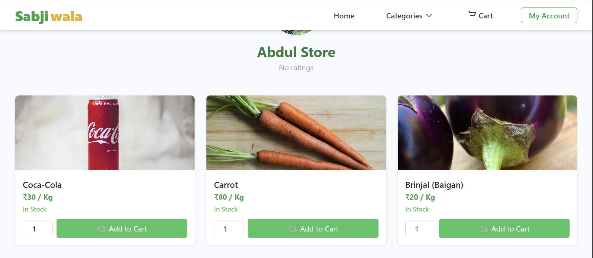
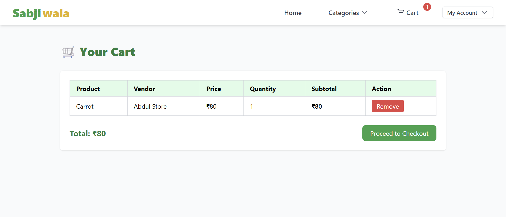
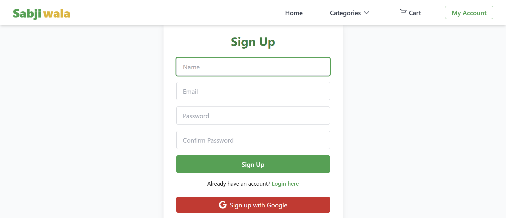
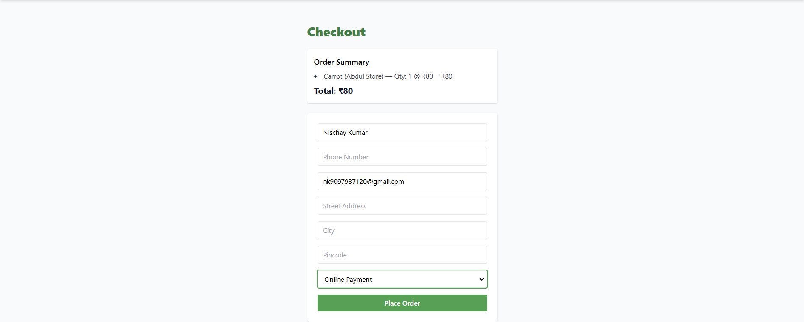
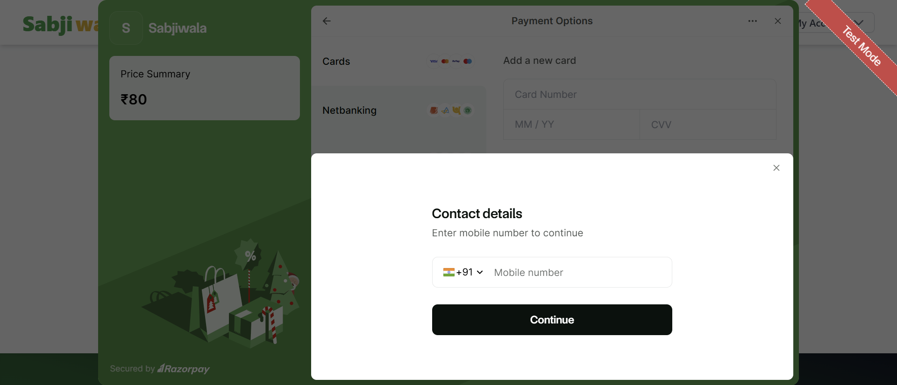

# Sabjiwala – Online Grocery Ordering System

Sabjiwala is a full-stack online grocery ordering platform built using
the MERN stack. The application supports multiple user roles including
customers, vendors, admins, and delivery partners, simulating a
real-world e-commerce system.

🔗 **Live Demo:** https://sabjiwala-x6y1.onrender.com/

---

## 📸 Screenshots

### Home Page

### Product Listing

### Cart

### Signup

### Checkout

### Razorpay Payment

---

## 🚀 Features

- Multi-role authentication (Customer, Vendor, Admin, Delivery Partner)
- Product listing and category-based browsing
- Cart and order management system
- Role-specific dashboards
- Order tracking and status updates
- Google OAuth authentication
- Razorpay payment gateway integration
- Responsive UI for desktop and mobile
- Secure REST APIs

---

## 🛠️ Tech Stack

### Frontend
- HTML
- CSS
- JavaScript (ES6)
- Tailwind CSS

### Backend
- Node.js
- Express.js
- REST APIs
- MVC Architecture

### Database
- MongoDB
- MongoDB Atlas
- Mongoose

### Authentication & Payments
- Google OAuth
- JWT Authentication
- Razorpay Payment Gateway

### Tools & Deployment
- Git & GitHub
- Postman
- Render

---

## ⚙️ How This Project Works

1. Users sign up or log in using Google OAuth or normal authentication
2. Customers browse products, add items to cart, and place orders
3. Payments are processed securely using Razorpay
4. Vendors manage products and update order status
5. Delivery partners track and deliver orders
6. Admin manages users, products, and platform operations
7. All data is securely stored in MongoDB

---

## 📂 Project Structure

/controllers
/routes
/models
/views
/public
server.js

---

## 📚 What I Learned

- Building scalable multi-role applications using MERN stack
- Implementing authentication with Google OAuth and JWT
- Integrating Razorpay for secure online payments
- Designing role-based dashboards and access control
- Managing complex application workflows
- Deploying full-stack applications on cloud platforms

